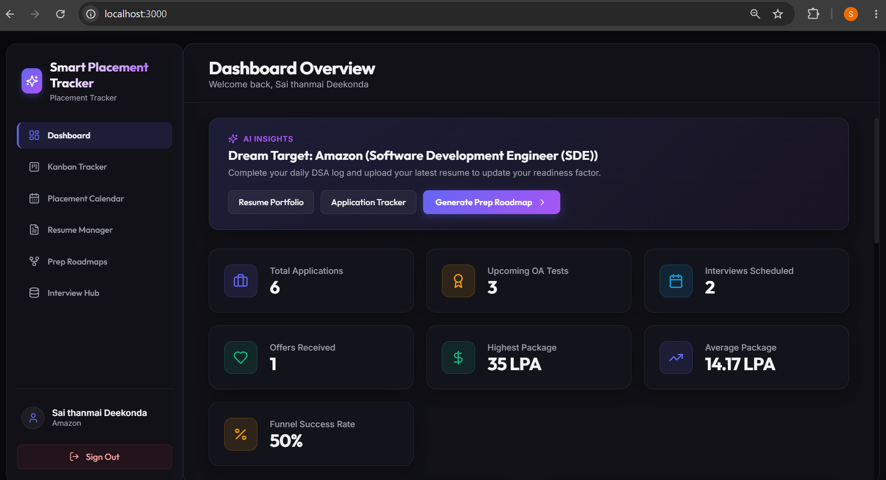
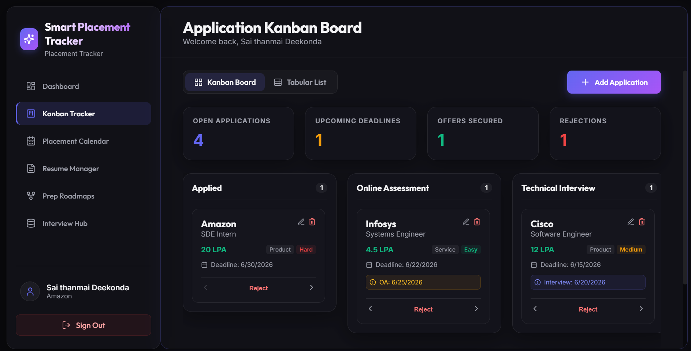
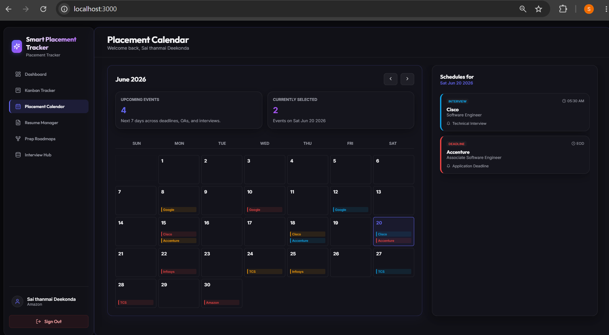
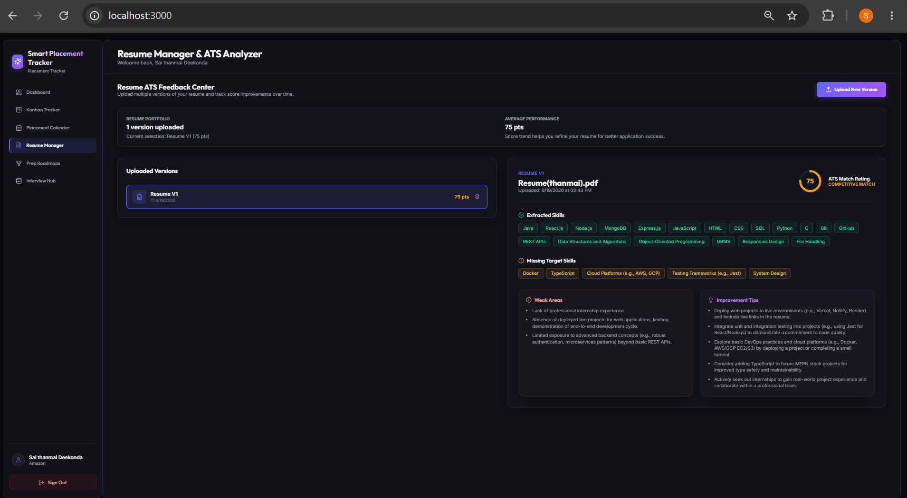
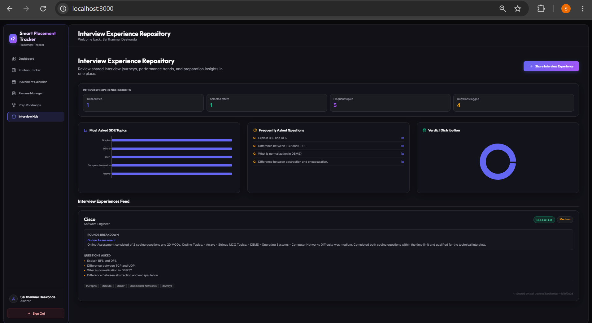

# Smart Placement Tracker (MERN + Gemini AI)

A complete, production-ready campus placement tracking and AI career preparation system designed to replace scattered Excel sheets, calendars, and text files. Students can manage their entire application lifecycle, visualize funnel statistics, calendar scheduling, share real-world interview logs, and optimize their SDE competencies via automated resume scoring and company-wise prep roadmaps powered by Gemini AI.

---

## Technical Stack & Architecture

- **Frontend**: React (Vite-based SPA), Recharts (data visualization), Lucide React (vector icons).
- **Backend**: Node.js, Express.js (REST API, scoped routers).
- **Database**: MongoDB (Mongoose schemas, indexing).
- **AI Engine**: Google AI Studio (Gemini 2.5 Flash model via `@google/generative-ai` SDK).
- **Background Jobs**: `node-cron` scheduled reminders + `nodemailer` email dispatchers.

---

## File Structure

```
smart-placement-tracker/
├── README.md
├── server/
│   ├── package.json
│   ├── .env
│   ├── .env.example
│   ├── server.js
│   ├── config/
│   │   └── db.js
│   ├── controllers/
│   │   ├── authController.js
│   │   ├── companyController.js
│   │   ├── resumeController.js
│   │   ├── roadmapController.js
│   │   ├── notificationController.js
│   │   ├── experienceController.js
│   │   └── statsController.js
│   ├── middleware/
│   │   ├── authMiddleware.js
│   │   └── uploadMiddleware.js
│   ├── models/
│   │   ├── User.js
│   │   ├── Company.js
│   │   ├── Resume.js
│   │   ├── Roadmap.js
│   │   ├── Notification.js
│   │   └── InterviewExperience.js
│   ├── services/
│   │   └── reminderService.js
│   └── uploads/ (dynamically created for PDF resumes)
│   └── logs/ (contains simulated_emails.log for testing)
└── client/
    ├── package.json
    ├── index.html
    ├── vite.config.js
    └── src/
        ├── main.jsx
        ├── index.css
        ├── App.jsx
        ├── components/
        │   ├── Sidebar.jsx
        │   ├── Navbar.jsx
        │   ├── StatsCard.jsx
        │   ├── ApplicationModal.jsx
        │   ├── ResumeUploadModal.jsx
        │   └── AnalysisPanel.jsx
        ├── context/
        │   └── AuthContext.jsx
        └── pages/
            ├── Login.jsx
            ├── Register.jsx
            ├── Dashboard.jsx
            ├── Tracker.jsx
            ├── Calendar.jsx
            ├── ResumeManager.jsx
            ├── PrepRoadmaps.jsx
            ├── InterviewRepository.jsx
            └── Profile.jsx
```

---

## Installation & Setup

### Prerequisites
1. [Node.js](https://nodejs.org/) (v18.0.0 or higher)
2. [MongoDB](https://www.mongodb.com/try/download/community) running locally on port `27017` (or a remote MongoDB Atlas URI)

### Setup Instructions

1. **Clone/Open Workspace**:
   ```bash
   cd C:\smart-placement-tracker
   ```

2. **Configure Backend**:
   - Navigate to `/server` and configure environment variables in `.env`:
     ```env
     PORT=5000
     MONGODB_URI=mongodb://127.0.0.1:27017/smart-placement-tracker
     JWT_SECRET=your_jwt_secret_key_here
     
     # Google Gemini API Key (get one from Google AI Studio)
     # Set to 'mock_mode' to run the application using simulated AI generators
     GEMINI_API_KEY=your_gemini_api_key_here
     
     # SMTP Configuration for Email Reminders
     SMTP_HOST=smtp.gmail.com
     SMTP_PORT=587
     SMTP_USER=your_email@gmail.com
     SMTP_PASS=your_email_app_password
     EMAIL_FROM=notifications@smartplacement.com
     ```

3. **Install Dependencies**:
   - If not already done, install packages for both folders:
     ```bash
     # Install backend packages
     cd server
     npm install
     
     # Install frontend packages
     cd ../client
     npm install
     ```

4. **Running Locally**:
   - To start the Backend Server (runs on `http://localhost:5000`):
     ```bash
     cd server
     npm run dev
     ```
   - To start the React/Vite Client (runs on `http://localhost:3000`):
     ```bash
     cd client
     npm run dev
     ```

---

## Key Feature Guide

1. **Dashboard & Placement Readiness**:
   - Visualizes critical KPI counters.
   - Computes your **Placement Readiness Score** dynamically using a weighted metric:
     - DSA solved (30% weight - Target: 300)
     - Projects completed (25% weight - Target: 3)
     - Resume score (20% weight - Target: 100)
     - Applications tracked (15% weight - Target: 10)
     - Mock interviews logged (10% weight - Target: 5)

2. **Kanban Tracker Board**:
   - Visualizes applications in columns: `Applied`, `Online Assessment`, `Technical Interview`, `HR Interview`, and `Selected`.
   - Allows moving applications left/right or rejecting them.
   - Links applications to uploaded resumes and schedules.

3. **Placement Calendar**:
   - A custom month-grid view displaying upcoming OA test dates, interviews, and deadlines.
   - Selecting a calendar date outputs detailed agenda lists.

4. **Resume Manager (ATS Parser)**:
   - Upload PDF resumes to trigger Gemini analysis.
   - Extracts skills, identifies target gaps, flags weak areas, and gives feedback.
   - Retains history (V1, V2, V3) and plots score improvements over time.

5. **AI Prep Roadmaps**:
   - Submit a target company (e.g. Cisco) and job role.
   - Cross-references your resume skills and generates custom study roadmaps, topic checklists, and typical interview questions.

6. **Email & In-App Notifications**:
   - A node-cron scheduler scans upcoming events every hour.
   - Triggers alerts for upcoming OAs, deadlines, and interviews.
   - Logs simulated SMTP email payloads in `server/logs/simulated_emails.log` for easy testing if no mail servers are configured.

7. **Interview Experience Hub**:
   - Share and search recruitment questions and rounds.
   - Aggregates trends like "Most Asked Topics" and "Verdicts".

## Screenshots

### Dashboard


### Application Tracker


### Placement Calendar


### Resume ATS Analyzer


### AI Prep Roadmaps


### Interview Experience Repository
